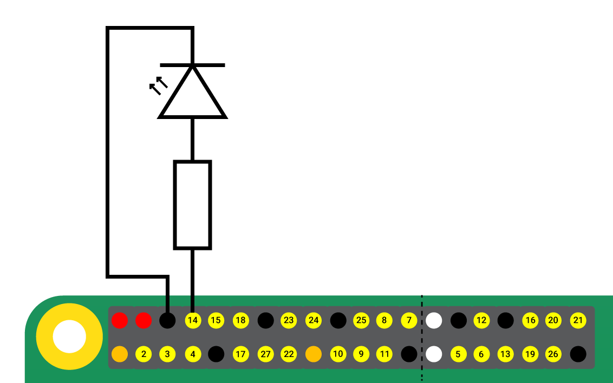
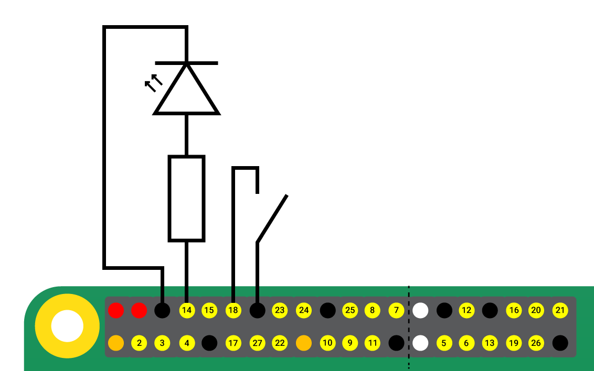

# JGPIO examples

Before start with examples please check [System Preparation](../README.md#system-preparation)

## How to build

To build the project run the command:

```
mvn clean package
```

The following outputs will be created in the `target` directory:

* `jgpio-examples.jar` file
* `libs` directory

Copy these files to the device with GPIO pins.

## Blink

This example was prepared and tested on a Raspberry PI 5.  
To make this work on other boards, you will have to modify the chip and line in the source code.

If you are working with a Raspberry 5, connect the LED with a resistor between `GND` and  `GPIO14`,
as shown below:



Then run the Blink application using command:

```
java \
  --enable-native-access=eu.softpol.lib.jgpio \
  -p jgpio-examples.jar:libs \
  -m eu.softpol.lib.jgpioexamples/eu.softpol.lib.jgpioexamples.Blink
```

The LED should blink 10 times.

## Toggle

This example is based on the blink, just add a button between `GND` and `GPIO18`, as shown below:



To run use command:

```
java \
  --enable-native-access=eu.softpol.lib.jgpio \
  -p jgpio-examples.jar:libs \
  -m eu.softpol.lib.jgpioexamples/eu.softpol.lib.jgpioexamples.Toggle
```

When the button is pressed, the LED should be on.

## ShowAllChipsAndLines

This example lists all chips and lines, it's similar to `gpiodetect` and `gpioinfo`.

To run use command:

```
java \
  --enable-native-access=eu.softpol.lib.jgpio \
  -p jgpio-examples.jar:libs \
  -m eu.softpol.lib.jgpioexamples/eu.softpol.lib.jgpioexamples.ShowAllChipsAndLines
```

<details>
<summary>Sample output</summary>

```
--------------------------------------------------------------------------------
Chip name: gpiochip0
Chip label: pinctrl-rp1
Chip lines(54):
offset                           name                          in use  direction
     0                         ID_SDA                              no      input
     1                         ID_SCL                              no      input
     2                          GPIO2                              no      input
     3                          GPIO3                              no      input
     4                          GPIO4                              no      input
     5                          GPIO5                              no      input
     6                          GPIO6                              no      input
     7                          GPIO7                              no      input
     8                          GPIO8                              no      input
     9                          GPIO9                              no      input
    10                         GPIO10                              no      input
    11                         GPIO11                              no      input
    12                         GPIO12                              no      input
    13                         GPIO13                              no      input
    14                         GPIO14                              no     output
    15                         GPIO15                              no      input
    16                         GPIO16                              no      input
    17                         GPIO17                              no      input
    18                         GPIO18                              no      input
    19                         GPIO19                              no      input
    20                         GPIO20                              no      input
    21                         GPIO21                              no      input
    22                         GPIO22                              no      input
    23                         GPIO23                              no      input
    24                         GPIO24                              no      input
    25                         GPIO25                              no      input
    26                         GPIO26                              no      input
    27                         GPIO27                              no      input
    28                  PCIE_RP1_WAKE                              no      input
    29                       FAN_TACH                              no      input
    30                       HOST_SDA                              no      input
    31                       HOST_SCL                              no      input
    32                      ETH_RST_N             used by "phy-reset"     output
    33                              -                              no      input
    34                 CD0_IO0_MICCLK              used by "cam0_reg"     output
    35                CD0_IO0_MICDAT0                              no      input
    36              RP1_PCIE_CLKREQ_N                              no      input
    37                              -                              no      input
    38                        CD0_SDA                              no      input
    39                        CD0_SCL                              no      input
    40                        CD1_SDA                              no      input
    41                        CD1_SCL                              no      input
    42                    USB_VBUS_EN                              no     output
    43                       USB_OC_N                              no      input
    44                   RP1_STAT_LED                   used by "PWR"     output
    45                        FAN_PWM                              no      input
    46                 CD1_IO0_MICCLK              used by "cam1_reg"     output
    47                      2712_WAKE                              no      input
    48                CD1_IO1_MICDAT1                              no      input
    49                 EN_MAX_USB_CUR                              no     output
    50                              -                              no      input
    51                              -                              no      input
    52                              -                              no      input
    53                              -                              no      input

--------------------------------------------------------------------------------
Chip name: gpiochip10
Chip label: gpio-brcmstb@107d508500
Chip lines(32):
offset                           name                          in use  direction
     0                              -                              no      input
     1                 2712_BOOT_CS_N             used by "spi10 CS0"     output
     2                 2712_BOOT_MISO                              no      input
     3                 2712_BOOT_MOSI                              no      input
     4                 2712_BOOT_SCLK                              no      input
     5                              -                              no      input
     6                              -                              no      input
     7                              -                              no      input
     8                              -                              no      input
     9                              -                              no      input
    10                              -                              no      input
    11                              -                              no      input
    12                              -                              no      input
    13                              -                              no      input
    14                       PCIE_SDA                              no      input
    15                       PCIE_SCL                              no      input
    16                              -                              no      input
    17                              -                              no      input
    18                              -                              no      input
    19                              -                              no      input
    20                       PWR_GPIO            used by "pwr_button"      input
    21                    2712_G21_FS                              no      input
    22                              -                              no      input
    23                              -                              no      input
    24                         BT_RTS                              no      input
    25                         BT_CTS                              no      input
    26                         BT_TXD                              no      input
    27                         BT_RXD                              no      input
    28                          WL_ON             used by "wl_on_reg"     output
    29                          BT_ON              used by "shutdown"     output
    30                  WIFI_SDIO_CLK                              no      input
    31                  WIFI_SDIO_CMD                              no      input

--------------------------------------------------------------------------------
Chip name: gpiochip11
Chip label: gpio-brcmstb@107d508520
Chip lines(4):
offset                           name                          in use  direction
     0                   WIFI_SDIO_D0                              no      input
     1                   WIFI_SDIO_D1                              no      input
     2                   WIFI_SDIO_D2                              no      input
     3                   WIFI_SDIO_D3                              no      input

--------------------------------------------------------------------------------
Chip name: gpiochip12
Chip label: gpio-brcmstb@107d517c00
Chip lines(17):
offset                           name                          in use  direction
     0                        RP1_SDA                              no      input
     1                        RP1_SCL                              no      input
     2                        RP1_RUN           used by "RP1 RUN pin"     output
     3                   SD_IOVDD_SEL             used by "vdd-sd-io"     output
     4                      SD_PWR_ON            used by "sd_vcc_reg"     output
     5                      SD_CDET_N                    used by "cd"      input
     6                       SD_FLG_N                              no      input
     7                              -                              no      input
     8                      2712_WAKE                              no      input
     9                  2712_STAT_LED                   used by "ACT"     output
    10                              -                              no      input
    11                              -                              no      input
    12                       PMIC_INT                              no      input
    13                     UART_TX_FS                              no      input
    14                     UART_RX_FS                              no      input
    15                              -                              no      input
    16                              -                              no      input

--------------------------------------------------------------------------------
Chip name: gpiochip13
Chip label: gpio-brcmstb@107d517c20
Chip lines(6):
offset                           name                          in use  direction
     0                      HDMI0_SCL                              no      input
     1                      HDMI0_SDA                              no      input
     2                      HDMI1_SCL                              no      input
     3                      HDMI1_SDA                              no      input
     4                       PMIC_SCL                              no      input
     5                       PMIC_SDA                              no      input

--------------------------------------------------------------------------------
Chip name: gpiochip0
Chip label: pinctrl-rp1
Chip lines(54):
offset                           name                          in use  direction
     0                         ID_SDA                              no      input
     1                         ID_SCL                              no      input
     2                          GPIO2                              no      input
     3                          GPIO3                              no      input
     4                          GPIO4                              no      input
     5                          GPIO5                              no      input
     6                          GPIO6                              no      input
     7                          GPIO7                              no      input
     8                          GPIO8                              no      input
     9                          GPIO9                              no      input
    10                         GPIO10                              no      input
    11                         GPIO11                              no      input
    12                         GPIO12                              no      input
    13                         GPIO13                              no      input
    14                         GPIO14                              no     output
    15                         GPIO15                              no      input
    16                         GPIO16                              no      input
    17                         GPIO17                              no      input
    18                         GPIO18                              no      input
    19                         GPIO19                              no      input
    20                         GPIO20                              no      input
    21                         GPIO21                              no      input
    22                         GPIO22                              no      input
    23                         GPIO23                              no      input
    24                         GPIO24                              no      input
    25                         GPIO25                              no      input
    26                         GPIO26                              no      input
    27                         GPIO27                              no      input
    28                  PCIE_RP1_WAKE                              no      input
    29                       FAN_TACH                              no      input
    30                       HOST_SDA                              no      input
    31                       HOST_SCL                              no      input
    32                      ETH_RST_N             used by "phy-reset"     output
    33                              -                              no      input
    34                 CD0_IO0_MICCLK              used by "cam0_reg"     output
    35                CD0_IO0_MICDAT0                              no      input
    36              RP1_PCIE_CLKREQ_N                              no      input
    37                              -                              no      input
    38                        CD0_SDA                              no      input
    39                        CD0_SCL                              no      input
    40                        CD1_SDA                              no      input
    41                        CD1_SCL                              no      input
    42                    USB_VBUS_EN                              no     output
    43                       USB_OC_N                              no      input
    44                   RP1_STAT_LED                   used by "PWR"     output
    45                        FAN_PWM                              no      input
    46                 CD1_IO0_MICCLK              used by "cam1_reg"     output
    47                      2712_WAKE                              no      input
    48                CD1_IO1_MICDAT1                              no      input
    49                 EN_MAX_USB_CUR                              no     output
    50                              -                              no      input
    51                              -                              no      input
    52                              -                              no      input
    53                              -                              no      input

```

</details>
